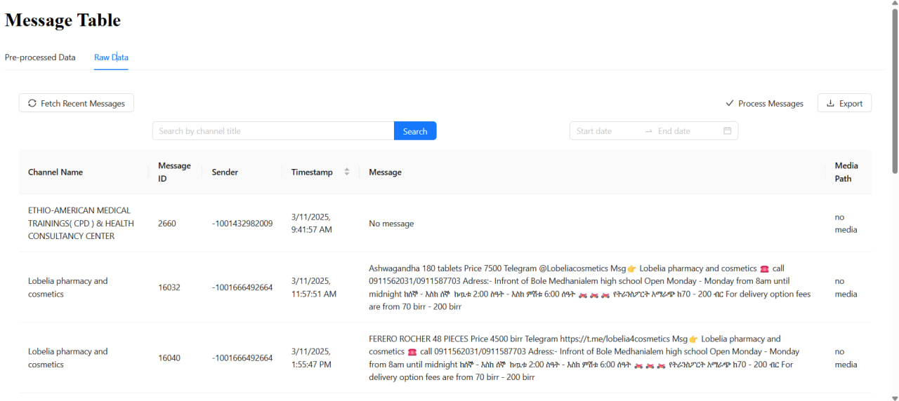
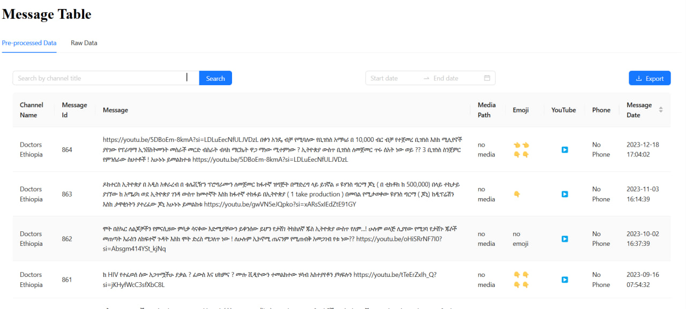

# Data Scraping, Processing, and API Exposure Pipeline




## Project Overview

This project implements a complete data pipeline for scraping, processing, storing, and exposing data from public Telegram channels relevant to Ethiopian medical businesses. The pipeline includes:

- **Data Scraping & Collection**: Extracting raw data and images from Telegram channels.
- **Data Cleaning & Transformation**: Removing duplicates, handling missing values, and transforming data using DBT.
- **Object Detection**: Using YOLO to detect objects in collected images.
- **API Exposure**: Providing access to collected and processed data using FastAPI.

## Folder Structure

```
Data-Warehouse
│   .env
│   .gitignore
│   extractor.py
│   main.py
│   README.md
│   requirements.txt
│   scraper_session.session
│   tree.txt
│   yolov5s.pt
│
├── api
│   │   crud.py
│   │   database.py
│   │   main.py
│   │   models.py
│   │   schemas.py
│   ├── logs
│   └── __pycache__
│
├── data
│   │   cleaned_data.csv
│   │   detection_results.csv
│   ├── raw
│   │   │   CheMed123.json
│   │   │   DoctorsET.json
│   │   │   EAHCI.json
│   │   │   lobelia4cosmetics.json
│   │   │   yetenaweg.json
│
├── downloads
│
├── images
│   │   photo_2025-01-31_05-30-28.jpg
│   ├── detected_images
│   │   │   photo_2025-01-31_05-30-28.jpg
│   │   ├── labels
│   │   │   photo_2025-01-31_05-30-28.txt
│
├── logs
│   │   database_setup.log
│   │   data_cleaning.log
│   │   dbt.log
│   │   scraper.log
│
├── metadata
│   │   last_fetched.json
│
├── my_project
│   │   dbt_project.yml
│   │   README.md
│   ├── models
│   │   │   select_2_rows_per_channel_title.sql
│   │   │   sources.yml
│
├── notebooks
│   │   data_cleaning.ipynb
│   │   db_connection.ipynb
│
├── scripts
│   │   data_cleaning.py
│   │   detect_object.py
│   │   telegram_scrapper.py
└──
```

---

## Installation and Setup

### Prerequisites

Ensure you have the following installed:

- Python 3.10+
- PostgreSQL or SQLite
- pip and virtualenv

### Step 1: Clone the Repository

```sh
git clone https://github.com/Tsegaye16/Data-warehouse
cd Data-warehouse
```

### Step 2: Install Dependencies

```sh
pip install -r requirements.txt
```

### Step 3: Configure Environment Variables

Create a `.env` file and set up required environment variables:

```
API_ID=<your api id>
API_HASH=<your api hash>
SESSION_NAME=scraper_session
DATABASE_URL=postgresql://postgres:<db_password>@localhost:<db_port>/<bd_name>
```

---

## Task 1: Data Scraping and Collection

### Telegram Scraping

Using `Telethon`, data is extracted from public Telegram channels:

```sh
python scripts/telegram_scrapper.py
```

- The raw data is stored in `data/raw/`
- Logs are recorded in `logs/scraper.log`

### Image Collection

Images are downloaded and stored in `images/`.

---

## Task 2: Data Cleaning and Transformation

### Data Cleaning

- Removing duplicates
- Handling missing values
- Standardizing formats

Run:

```sh
python scripts/data_cleaning.py
```

Cleaned data is stored in `data/cleaned_data.csv`.

### DBT Transformation

```sh
dbt run
```

- Models are in `my_project/models/`
- Logs are recorded in `logs/dbt.log`

---

## Task 3: Object Detection with YOLO

### Setup

```sh
git clone https://github.com/ultralytics/yolov5.git
cd yolov5
pip install -r requirements.txt
```

### Running Object Detection

```sh
python scripts/detect_object.py
```

Detected objects and labels are stored in `images/detected_images/`.

---

## Task 4: API Exposure using FastAPI

### Running FastAPI

```sh
uvicorn api.main:app --reload
```

Endpoints:

- `POST /messages` - Endpoint to add a new message
- `GET /messages` - Endpoint to retrieve messages with a limit
- `GET /messages/{channel_title}` - Endpoint to retrieve messages based on channel_title and limit
- `DELETE /messages/{message_id}` - Endpoint to delete a message# Endpoint to delete a message by message_id
- `PUT /messages/{message_id}` - Endpoint to update a message by message_id

### Database Configuration

- PostgreSQL/SQLite setup in `api/database.py`
- ORM models in `api/models.py`
- API schemas in `api/schemas.py`
- CRUD operations in `api/crud.py`

---

## Monitoring and Logging

- Scraper logs: `logs/scraper.log`
- DBT logs: `logs/dbt.log`
- API logs: `logs/database_setup.log`

---

## Contributing

1. Fork the repository
2. Create a feature branch
3. Submit a pull request

---

## License

MIT License
